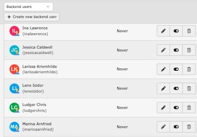

<div align="center">


# TYPO3 extension `typo3_letter_avatar`

[](LICENSE.md)

</div>

> [!WARNING]
> Under active development

This extension generates colorful backend user avatars using name initial letters.



## Features

* Generates out-of-the-box colorful avatars for backend users
* Easily customizable and flexible configuration
* Provides different predefined color modes and themes
* Supports frontend user avatars with an additional viewhelper

## Requirements

* TYPO3 >= 11.5 & PHP 8.1+

## Installation

### Composer

[](https://packagist.org/packages/konradmichalik/typo3-letter-avatar)
[](https://packagist.org/packages/konradmichalik/typo3-letter-avatar)

``` bash
composer require konradmichalik/typo3-letter-avatar
```

### TER

[](https://extensions.typo3.org/extension/typo3_letter_avatar)
[](https://extensions.typo3.org/extension/typo3_letter_avatar)

Download the zip file from [TYPO3 extension repository (TER)](https://extensions.typo3.org/extension/typo3_letter_avatar).

## Setup

Set up the extension after the installation:

``` bash
vendor/bin/typo3 extension:setup --extension=typo3_letter_avatar
```

The extension will automatically generate avatars for all existing backend users.

## Configuration

Use the out-of-the-box configuration available in the extension settings or customize it in your own extension.

### Extension Configuration

Use the extension configuration under `Admin Tools > Settings > Extension Configuration > typo3_letter_avatar` for the following options:

* **Color mode**: Select the color mode for the avatar generation. Available modes:
  * `STRINGIFY`: Creates a random color based on the name.
  * `RANDOM`: Randomly selected colors. See available [color pairs](ext_localconf.php#44).
  * `THEME`: Select this mode to choose a predefined color theme.
  * `PAIRS`: Randomly selected color pairs. See available [color pairs](ext_localconf.php#71).
  * `CUSTOM`: Custom colors defined in the configuration. Only available via the custom configuration.
* **Theme**: Only for color mode "Theme". Select the color theme (collection of foreground and background colors) for the avatar generation. See available [themes](ext_localconf.php#107).

### Custom

The [default configuration](ext_localconf.php#107) can be easily overridden in your own extension. You can use the following code snippet to create a custom configuration:

```php
<?php

// add custom theme
$GLOBALS['TYPO3_CONF_VARS']['EXTCONF']['typo3_letter_avatar']['configuration']['themes']['customTheme'] = [
    'foregrounds' => [
        '#FFFFFF',
        '#000000',
        '#333333',
        '#FFFAFA',
        '#F5F5F5',
    ],
    'backgrounds' => [
        '#1E90FF',
        '#32CD32',
        '#FF4500',
        '#FFD700',
        '#8A2BE2',
    ],
];

// set custom theme
// warning: this will override the extension setting
$GLOBALS['TYPO3_CONF_VARS']['EXTCONF']['typo3_letter_avatar']['configuration']['theme'] = 'customTheme'
```

## Usage

The extension works for backend users out of the box.

### Reusage

If you want to use it for other use cases, you can use the following code snippet to generate an avatar image:

```php
// Generate avatar entity
$avatar = \KonradMichalik\Typo3LetterAvatar\Image\Avatar::create(
    name: 'Konrad Michalik',
    mode: KonradMichalik\Typo3LetterAvatar\Enum\ColorMode::RANDOM
);
// Save avatar image to default path
$avatar->save();
// Get web path of generated image
$avatar->getWebPath();
```

> [!NOTE]
> See available parameters in the [AbstractImageProvider](Classes/Image/AbstractImageProvider.php#17)

### ViewHelper

You can use the `KonradMichalik\Typo3LetterAvatar\ViewHelpers\AvatarViewHelper` to generate an letter avatar image path in your Fluid templates, e.g. for frontend users:

```html
<html xmlns:letter="http://typo3.org/ns/KonradMichalik/Typo3LetterAvatar/ViewHelpers">


```

> [!NOTE]
> See available arguments in the [AvatarViewHelper](Classes/ViewHelpers/AvatarViewHelper.php).

### Console Command

Once the avatars are generated, you can use the console command to clear all avatars and implicitly regenerate them. Use the following console command to clear the generated avatars:

```bash
vendor/bin/typo3 avatar:clear
```

### EventListener

You can use the `BackendUserAvatarConfigurationEvent` to modify the avatar configuration according to the current backend user:

```php
<?php

declare(strict_types=1);

namespace Vendor\Package\EventListener;

use KonradMichalik\Typo3LetterAvatar\Enum\ColorMode;
use KonradMichalik\Typo3LetterAvatar\Event\BackendUserAvatarConfigurationEvent;

class ModifyLetterAvatarEventListener
{
    public function __invoke(BackendUserAvatarConfigurationEvent $event): void
    {
        $backendUser = $event->getBackendUser();
        
        /*
         * Example: If the backend user is an admin, set the CUSTOM color mode and define custom colors.
         */ 
        if ($backendUser['admin'] === 1) {
            $configuration = $event->getConfiguration();
            $configuration['mode'] = ColorMode::CUSTOM;
            $configuration['foreground'] = '#000000';
            $configuration['background'] = '#FFFFFF';
            
            $event->setConfiguration($configuration);
        }
    }
}
```

> [!NOTE]
> Don't forget to [register the event listener](https://docs.typo3.org/m/typo3/reference-coreapi/main/en-us/ApiOverview/Events/EventDispatcher/Index.html#registering-the-event-listener-via-file-services-yaml).

## Development

Use the following ddev command to easily install all supported TYPO3 versions for locale development.

```bash
ddev install all
```

## Credits

This project is highly inspired by [avatar](https://github.com/laravolt/avatar) and [letter-avatar](https://github.com/yohangdev/letter-avatar).

## License

This project is licensed under [GNU General Public License 2.0 (or later)](LICENSE.md).
